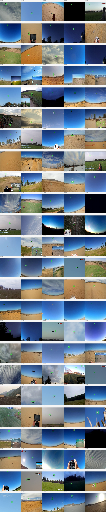
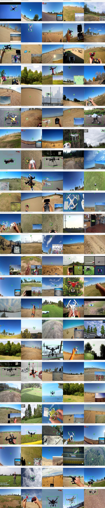
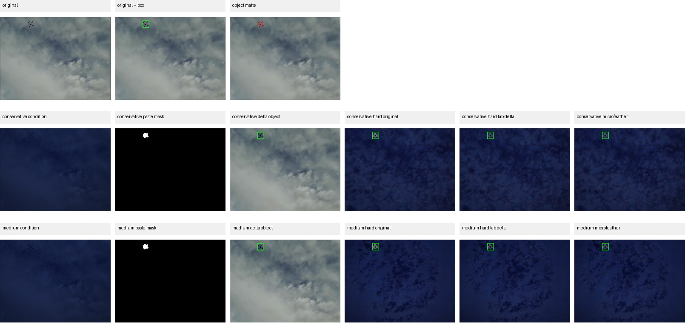
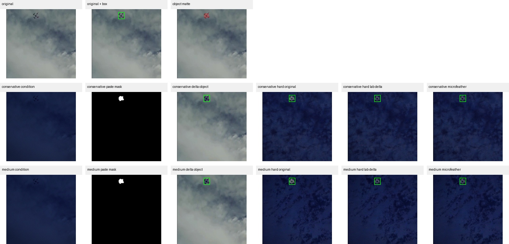

# UAV Synthetic Augmentation

Object-preserving synthetic data augmentation pipeline for tiny drone detection in aerial imagery.

This project studies whether controlled data augmentation can improve YOLO drone detection under difficult visual conditions, especially night-like, low-light, hazy, or low-contrast scenarios, while preserving small drone objects and their bounding-box labels.

The project was built as a practical computer vision / data-centric AI project for aerial perception robustness.

---

## 1. Project motivation

Generic data augmentation can easily damage object detection datasets when the object is small.

For tiny drone detection, the main risks are:

* corrupting the drone pixels;
* changing the drone geometry while keeping the original label;
* hallucinating extra drone-like objects;
* creating object-context inconsistencies;
* generating visually impressive but detection-harmful images.

The core question of this project is:

> Can we transform the visual context of aerial drone images while preserving the drone object and keeping YOLO labels valid?

The project compares classical augmentation, object-preserving augmentation, and controlled diffusion-based night augmentation against a real-only YOLO baseline.

---

## 2. Dataset

Active dataset:

* Hugging Face dataset: `pathikg/drone-detection-dataset`
* Source annotation format: COCO-style bounding boxes
* Target format: YOLO normalized labels
* Class: `drone`

The source bounding boxes are converted from:

```
[x, y, width, height]
```

to YOLO format:

```
class_id x_center y_center width height
```

The working split used in this project is:

```
300 train / 80 val / 80 test
```

The converted dataset is generated locally under:

```
data/interim/yolo_drone_hf_300/
```

Datasets are not committed to Git.

---

## 3. Repository structure

```
uav-synthetic-augmentation/
├── configs/
├── src/
├── scripts/
├── docs/
├── data/
├── artifacts/
└── runs/
```

### `configs/`

Configuration files for the project.

Typical files:

* `configs/project.yaml`
* `configs/diffusion_v2.yaml`
* `configs/diffusion_source_blacklist.txt`

### `src/`

Reusable Python modules for:

* dataset preparation;
* image augmentation;
* source filtering;
* diffusion utilities;
* object matte creation;
* LAB photometric transfer;
* evaluation helpers.

### `scripts/`

Step-by-step executable Python scripts.

The project intentionally keeps scripts explicit and readable so that each stage of the pipeline can be run and defended independently.

### `docs/`

Documentation and selected visual examples.

Important files:

* `docs/PROJECT_HISTORY.md`
* `docs/REVIEW_CHECKLIST.md`

### `data/`

Local datasets.

This folder is ignored by Git except for `.gitkeep` files.

### `artifacts/`

Generated reports, tables, previews and analysis outputs.

This folder is ignored by Git except for `.gitkeep` files and selected documentation images copied into `docs/images/`.

### `runs/`

YOLO training outputs.

This folder is ignored by Git except for `.gitkeep`.

---

## 4. What the project compares

The project compares several training regimes.

### E0 — Real-only baseline

YOLO trained only on the real Hugging Face drone subset.

Purpose:

* establish a clean reference point;
* verify that the converted dataset is valid;
* measure whether augmentations help or hurt.

### E1 — Real + classical augmentation

Standard image-space augmentations with labels transformed accordingly.

Purpose:

* provide a strong non-generative augmentation baseline;
* compare diffusion against controlled augmentation.

### E2 — Real + object-preserving augmentation

Context or photometric modifications while explicitly preserving the drone region and labels.

Purpose:

* test whether object-preserving transformations can improve robustness without corrupting labels.

### E3/E4/E5 — Real + diffusion V2 augmentation

Controlled diffusion-based night augmentation with different numbers of generated images.

Planned ablations:

* real + 25 diffusion images;
* real + 50 diffusion images;
* real + 100 diffusion images.

Purpose:

* test whether synthetic night-like data improves robustness;
* measure whether adding more diffusion data helps or hurts;
* compare performance on real test data and stress tests.

---

## 5. Main pipeline

The current recommended pipeline is:

```
Hugging Face dataset
→ YOLO conversion
→ dataset validation and visualization
→ real-only YOLO baseline
→ classical augmentation baseline
→ diffusion source filtering
→ controlled diffusion V2 generation
→ LAB-delta object reinsertion
→ ablation datasets
→ YOLO training
→ real and stress-test evaluation
```

---

## 6. Environment check

Run:

```
python scripts/00_check_env.py
```

This checks:

* Python environment;
* PyTorch;
* MPS / CUDA / CPU availability;
* Ultralytics YOLO;
* Hugging Face datasets;
* OpenCV;
* Diffusers.

---

## 7. Prepare the Hugging Face dataset

Run:

```
python scripts/01_prepare_dataset.py --overwrite
```

This creates the YOLO-format dataset:

```
data/interim/yolo_drone_hf_300/
```

with:

```
images/train/
images/val/
images/test/
labels/train/
labels/val/
labels/test/
dataset.yaml
```

---

## 8. Preview and validate the dataset

Run the dataset preview / validation script:

```
python scripts/02_preview_dataset.py
```

The goal is to verify:

* bounding-box alignment;
* label validity;
* drone object sizes;
* split consistency;
* obvious image issues.

During inspection, several problematic source types were identified:

* picture-in-picture drone views;
* controller screens;
* HUD-like overlays;
* text and watermarks;
* drone-camera screen inserts;
* very large close-up drones.

These images may still exist in the real dataset, but they are risky as sources for diffusion generation.

---

## 9. Train the real-only YOLO baseline

Run:

```
python scripts/03_train_baseline.py
```

The baseline is trained on the real 300-image training split.

A representative 15-epoch run reached approximately:

* precision: 0.902
* recall: 0.911
* mAP50: 0.916
* mAP50-95: 0.608

Interpretation:

* the dataset conversion is valid;
* YOLO learns the drone class correctly;
* the baseline is already strong;
* synthetic data must be evaluated carefully because bad augmentations can degrade performance.

---

## 10. Classical augmentation

Run:

```
python scripts/04_make_augmentations.py
```

Then train augmented models:

```
python scripts/05_train_augmented.py
```

Classical augmentation provides an important non-generative baseline.

It is lower risk than diffusion because bounding boxes can be transformed deterministically and labels remain easier to validate.

---

## 11. First diffusion experiments and failure analysis

Initial diffusion experiments tested:

* global image-to-image;
* inpainting with protected object regions;
* inpainting with drone reinsertion.

The goal was to generate night-like contexts while preserving the drone.

Observed failure modes included:

* scene drift toward satellite or city night images;
* unrealistic star fields;
* surreal or unrelated landscapes;
* picture-in-picture amplification;
* rectangular halos around the drone;
* strong object-context discontinuity;
* hallucinated drone-like artifacts;
* duplicated flying objects.

Conclusion:

```
Naive diffusion generation is not reliable enough to be used directly for object detection training.
```

This failure analysis motivated the diffusion V2 pipeline.

---

## 12. Diffusion source filtering

Before diffusion generation, the project filters candidate source images.

The filtering removes or flags images with:

* picture-in-picture views;
* controller overlays;
* HUD elements;
* watermarks;
* internal rectangular windows;
* strong vertical seams;
* unsuitable drone sizes;
* overly large object masks.

The source filtering stage computes:

* mask coverage;
* internal rectangle score;
* UI rectangle score;
* inset window score;
* vertical seam score;
* box size statistics.

A manual blacklist is also supported:

```
configs/diffusion_source_blacklist.txt
```

Run:

```
python scripts/15_prepare_diffusion_sources.py --max-preview 120
```

This produces:

```
artifacts/tables/diffusion_v2_source_candidates.csv
artifacts/tables/diffusion_v2_source_accepted.csv
artifacts/tables/diffusion_v2_source_rejected.csv
artifacts/previews/diffusion_v2_sources/
```

The workflow is intentionally data-centric:

```
automatic filtering removes obvious bad cases;
manual review removes ambiguous remaining cases.
```

---

## 13. Diffusion V2: controlled night generation

The improved diffusion pipeline avoids asking the model to regenerate the drone.

Instead, it generates a night-like context while preserving the original drone geometry.

The V2 pipeline is:

```
source image
→ controlled night condition
→ conservative img2img
→ generated night context
→ object matte
→ LAB photometric delta transfer on the drone
→ hard reinsertion
```

The current recommended setting is:

```
preset = conservative
mode   = hard_lab_delta
```

Why this setting:

* conservative generation better preserves scene geometry;
* the drone is not regenerated by the diffusion model;
* the YOLO label remains valid;
* LAB delta transfer reduces daylight/night photometric mismatch;
* hard reinsertion keeps tiny drone edges sharp.

---

## 14. Object matte

A drone object matte is estimated from the YOLO box and local image information.

The purpose is to avoid using a large rectangular box mask, which previously produced visible rectangular halos.

The matte is used to identify the drone pixels to preserve and photometrically adapt.

---

## 15. LAB delta transfer

A key improvement is local LAB delta transfer.

Problem:

* the original drone often keeps daytime lighting;
* the generated context becomes night-like;
* direct reinsertion creates a visible mismatch.

Solution:

1. compute LAB statistics in a ring around the object in the original image;
2. compute LAB statistics in the same ring in the generated context;
3. estimate the local photometric transformation;
4. apply this transformation only to the drone pixels.

The transformation includes:

* luminance shift;
* mild contrast scaling;
* small A/B color shifts;
* slight blue bias for night consistency.

The corrected drone is then reinserted with a hard mask.

This preserves object geometry while making the drone more consistent with the generated night context.

---

## 16. Diffusion V2 inspection grids

Run:

```
PYTORCH_ENABLE_MPS_FALLBACK=1 python scripts/16_generate_diffusion_v2_grid.py \
  --overwrite \
  --max-images 5 \
  --presets conservative medium
```

This creates readable full and zoom inspection grids under:

```
artifacts/previews/diffusion_v2_grid/
```

The full grid shows:

* original;
* original with box;
* object matte;
* night condition;
* paste mask;
* LAB-corrected object;
* hard original reinsertion;
* hard LAB-delta reinsertion;
* microfeather LAB-delta reinsertion.

The zoom grid focuses on the drone region, which is necessary because drones are often very small.

---

## 17. Diffusion V2 pool generation

The recommended production mode is:

```
preset = conservative
mode   = hard_lab_delta
```

Run:

```
PYTORCH_ENABLE_MPS_FALLBACK=1 python scripts/17_generate_diffusion_v2_pool.py \
  --preset conservative \
  --mode hard_lab_delta \
  --max-images 100 \
  --max-preview 20 \
  --overwrite
```

For long runs on macOS, use:

```
caffeinate -dimsu env PYTORCH_ENABLE_MPS_FALLBACK=1 python scripts/17_generate_diffusion_v2_pool.py \
  --preset conservative \
  --mode hard_lab_delta \
  --max-images 100 \
  --max-preview 20 \
  --overwrite
```

The generated pool is written locally under:

```
data/augmented/yolo_drone_diffusion_v2_conservative_hard_lab_delta_pool/
```

This folder is not committed to Git.

---

## 18. Evaluation protocol

The planned evaluation compares:

* E0 — real-only baseline;
* E1 — real + classical augmentation;
* E2 — real + object-preserving augmentation;
* E3 — real + diffusion V2 LAB delta N=25;
* E4 — real + diffusion V2 LAB delta N=50;
* E5 — real + diffusion V2 LAB delta N=100.

Optional:

* E6 — real + diffusion V2 medium LAB delta N=100.

Metrics:

* precision;
* recall;
* mAP50;
* mAP50-95;
* AP by object size;
* false positives per image.

Evaluation datasets:

* real test;
* stress night;
* stress haze;
* stress low contrast.

The key question is:

```
Does diffusion augmentation improve robustness to night-like conditions
without degrading real-test performance?
```

---

## 19. Selected visual examples

Selected visual examples can be stored under:

```
docs/images/
```

Recommended examples:

* `docs/images/source_filter_accepted.jpg`
* `docs/images/source_filter_rejected.jpg`
* `docs/images/diffusion_v2_full_grid.jpg`
* `docs/images/diffusion_v2_zoom_grid.jpg`

If present, they are displayed below.

### Source filtering — accepted candidates



### Source filtering — rejected candidates



### Diffusion V2 full inspection grid



### Diffusion V2 zoom inspection grid



---

## 20. Key lessons

The project demonstrates several important lessons.

### Synthetic data is not automatically useful

The first diffusion attempts generated visually interesting but detection-harmful data.

### Visual quality is not enough

A generated image can look plausible while corrupting labels, hallucinating objects, or creating harmful distribution shifts.

### Object preservation is central

For tiny drone detection, preserving the drone geometry is more important than generating visually impressive backgrounds.

### Source filtering is necessary

Bad source images produce bad synthetic images.

Filtering out HUDs, overlays, picture-in-picture views, watermarks and large close-up drones is necessary before diffusion generation.

### Local photometric correction improves consistency

LAB delta transfer helps reduce the mismatch between a preserved drone and a generated night context.

### Evaluation must include robustness

A useful augmentation should be tested not only on real test data, but also on stress conditions and object-size-specific metrics.

---

## 21. Current status

Implemented:

* HF dataset preparation;
* YOLO-format conversion;
* dataset visualization;
* real-only YOLO baseline;
* classical augmentation;
* object-preserving augmentation;
* diffusion failure analysis;
* diffusion source filtering;
* diffusion V2 inspection grids;
* object matte generation;
* local LAB delta transfer;
* selected conservative hard-LAB-delta production mode.

Next steps:

1. generate the diffusion V2 pool;
2. build real + 25, real + 50 and real + 100 datasets;
3. train YOLO on each dataset;
4. run the full evaluation protocol;
5. summarize whether diffusion improves night robustness.

---

## 22. Limitations

Current limitations:

* the dataset subset is small;
* diffusion quality is not guaranteed;
* source filtering is heuristic and partly manual;
* object matte extraction is approximate;
* ControlNet is not used yet;
* generated data must be quantitatively evaluated before being considered useful.

These limitations are intentionally documented because they are part of the real engineering challenge of using generative augmentation for object detection.

---

## 23. Summary

This project evolved from a basic augmentation pipeline into a controlled object-preserving synthetic data evaluation framework.

The core engineering logic is:

```
filter sources
generate conservatively
preserve object geometry
adapt object photometry
inspect visually
evaluate quantitatively
document failure modes
```

The project is designed to show not only how to generate synthetic data, but how to decide whether that synthetic data is actually useful for robust drone detection.
